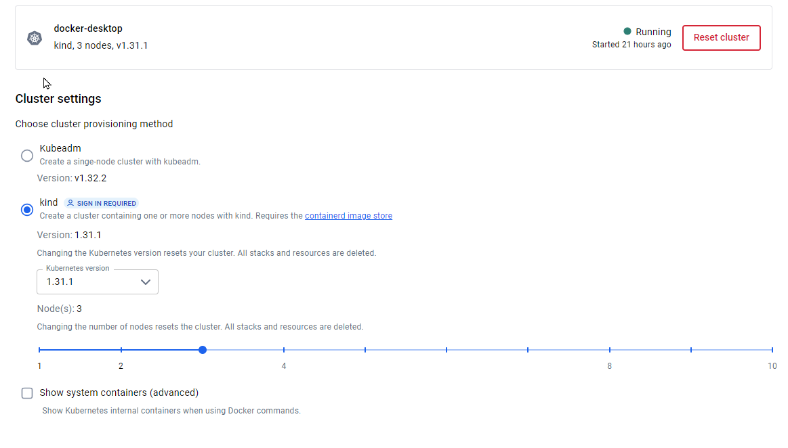
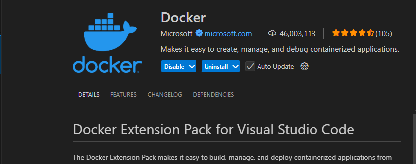

# Fundamentals

1) Setup your docker/docker hub acount at: https://hub.docker.com

2) Laptop (Needs to support virtualization and admin rights)

3) Win 10+

4) Setup WSL (https://docs.microsoft.com/en-us/windows/wsl/install)
    * Limit WSL:
       - Under: C:\users\[YourUser]\ edit/create: .wslconfig and add:
    ```
       [wsl2]
       memory=2GB
       processors=2
    ```
    Save the file and:
    ```
       wsl --shutdown
       wsl
    ```
5) Chocolatey (It is a packet manager for windows). https://chocolatey.org/install
   After install; 
   An PowerShell as Admin run: 
   ```
     choco upgrade all -y
   ```

6) Docker for windows, and Docker compose: https://www.docker.com/products/docker-desktop
   * Open it
   * Click on the upper gear
   * Enable Kubernetes
      *  Select "kind" and create 3 cluster nodes

    

7) Visual Studio Code: https://code.visualstudio.com/
   * Go to Extensions (Left pannel)
   * Search for Docker (From Microsoft)
   * Select it
   * Install it

   

8) Install k9s and lens
   ```
   choco install k9s
   choco install lens
   ```

9) Windows Terminal: https://docs.microsoft.com/en-us/windows/terminal/get-started


   