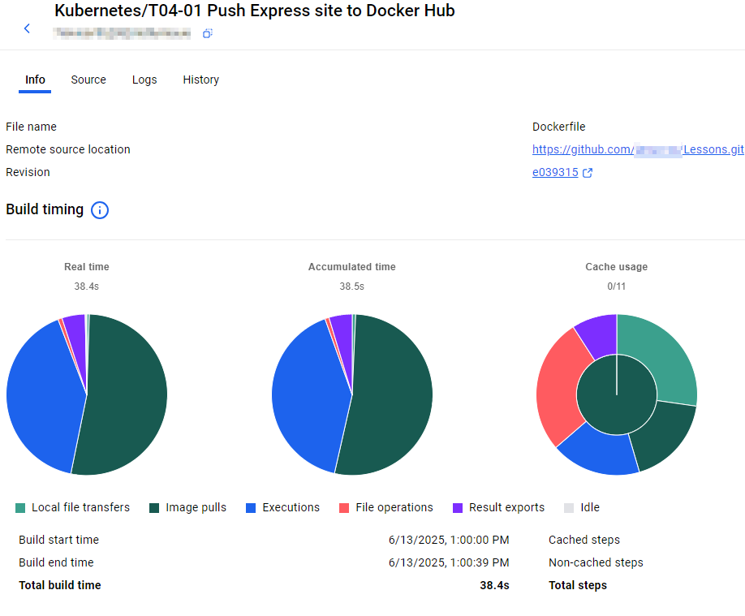

# L04-01 Push Express site to Docker Hub

## Docker Hub

Head to https://hub.docker.com and make sure you can log in.

## Login insede your docker desktop
```
   docker login -u USERNAME 
   docker pull dokcer.io/nginx:latest

   docker tag ngnix USERNAME/nginx:v1
   docker push USERNAME/nginx:v1

   Go to https://scout.docker.com/ and validate your images
   or 
   Open Docker-desktop > Images > Docker Hub repositories
```

### Let's build our image

## Add a Dockerfile file

Using the Code tooling, add a new Dockerfile by opening the Command Palette from the View menu.

1) Ctrl = Shift = P 
2) Docker: Add Docker Files to Workspace
3) Select Node.js
4) Select the package.json from wokking directory
5) Select: 3000
6) Select: No

7) Now:
```
docker build -t USERNAME/express:v1 .
```
You will see:
```log
=> => exporting layers                                                                                                                                          0.9s 
 => => exporting manifest sha256:d8e8c85f0e958f217342d51b65e621e8ed3e6a2f3fbf415be87a7dcb2bb43cb1                                                                0.0s 
 => => exporting config sha256:ac640166740932b35c3cc0fad574d3e8cb201af096a2ebf126647d1964083d40                                                                  0.0s 
 => => exporting attestation manifest sha256:a7797db6c4625fd73dd0df20297a348c1be3b827d1347479421cc211a9863900                                                    0.0s 
 => => exporting manifest list sha256:49371323b0cdecd03213fd66a58a1cce1ac2a391ed0300649916c4141acf8389                                                           0.0s 
 => => naming to docker.io/janux666/express:v1                                                                                                                   0.0s 
 => => unpacking to docker.io/janux666/express:v1                                                                                                                0.7s 

View build details: docker-desktop://dashboard/build/desktop-linux/desktop-linux/7k6kndyrtfq2082mbt9ymbxu6
```
In that link you will find image buld information like:



## Tag using your Docker account name

## Push the image

    docker push USERNAME/express:v1

It will take a wile x.x

## Docker Hub

Back in to https://hub.docker.com, locate the image you just pushed.

## Pull the image from Docker Hub

Let’s first delete the local image and pull it back from Docker Hub.

## Remove the image

    docker rmi <YourRegistryName>/express:v1

## Pull the image

    docker pull <YourRegistryName>/express:v1

---

## Create version 2

Using the commands you learned earlier, build and push this new version to Docker Hub.

## Build the v2 image

    docker build -t <YourRegistryName>/express:v2 .

## push the image

    docker push <YourRegistryName>/express:v2

## Docker Hub

Back in hub.docker.com, locate the image you just pushed.

## Remove the local image

    docker rmi <YourRegistryName>/express:v2

## Pull the image

    docker pull <YourRegistryName>/express:v1

## Cleanup

    docker rmi <YourRegistryName>/express:v1
    docker rmi <YourRegistryName>/express:v2