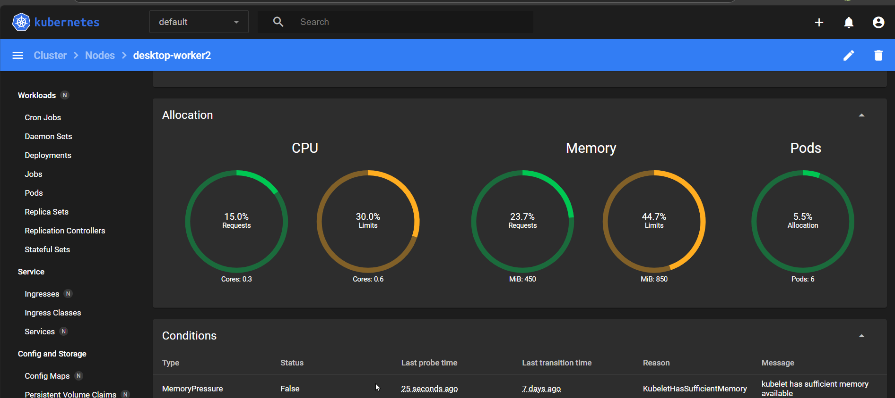

# Installing the Kubernetes Dashboard

- https://kubernetes.io/docs/tasks/access-application-cluster/web-ui-dashboard/
- https://github.com/kubernetes/dashboard/blob/master/docs/user/access-control/creating-sample-user.md
- https://github.com/kubernetes/dashboard

## Step to use:
1. Install the Kubernetes Dashboard:

   ```shell
   kubectl apply -f https://raw.githubusercontent.com/kubernetes/dashboard/v2.7.0/aio/deploy/recommended.yaml
   ```

2. Run 

   ```shell
   kubectl apply -f dashboard.adminuser.yml
   ```
   
3. Get a token (see https://github.com/kubernetes/dashboard/blob/master/docs/user/access-control/creating-sample-user.md) by running the command shown below. Copy the token into your clipboard.

   ```shell
   kubectl -n kubernetes-dashboard create token admin-user
   ```

4. Run 
  
   ```shell
   kubectl proxy
   ```
   > IMPORTANT: You will need to wait a few minues for the URL to work.
   

5. Visit http://localhost:8001/api/v1/namespaces/kubernetes-dashboard/services/https:kubernetes-dashboard:/proxy/
6. Paste the token into the login screen and you can then sign in to the dashboard.

>

7. But there are not Pods running lets add one and expose it to the world.
```
kubectl run mynginx --image=janux666/nginx:v1

kubectl port-forward mynginx --port=8080:80
```
Open: http://localhost:8080 and see the magic !

Ctrl + c to quit the port forward.