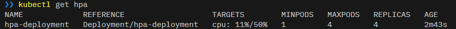
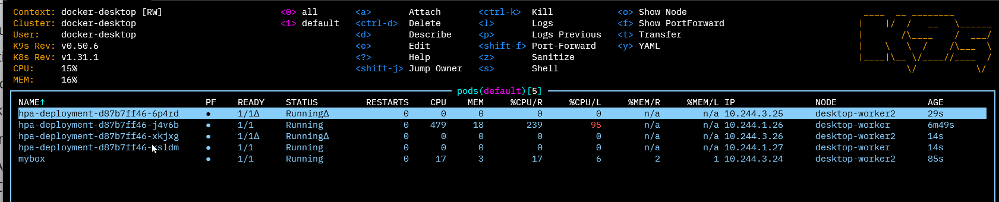
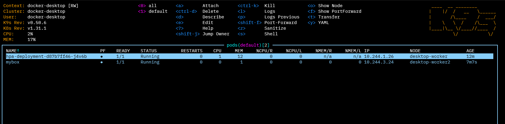

# T15-01 The Horizontal Pod Autoscaling

*In Kubernetes, a HorizontalPodAutoscaler automatically updates a workload resource (such as a Deployment or StatefulSet), with the aim of automatically scaling the workload to match demand.*

**Horizontal scaling** means that the response to increased load is to deploy more Pods. This is different from vertical scaling, which for Kubernetes would mean assigning more resources (for example: memory or CPU) to the Pods that are already running for the workload.

>If the load decreases, and the number of Pods is above the configured minimum, the HorizontalPodAutoscaler instructs the workload resource (the Deployment, StatefulSet, or other similar resource) to scale back down.

Horizontal pod autoscaling does not apply to objects that can't be scaled (for example: a DaemonSet.)

The HorizontalPodAutoscaler is implemented as a Kubernetes API resource and a controller. The resource determines the behavior of the controller. The horizontal pod autoscaling controller, running within the Kubernetes control plane, periodically adjusts the desired scale of its target (for example, a Deployment) to match observed metrics such as average CPU utilization, average memory utilization, or any other custom metric you specify.

## Let's use the Horizontal Pod Autoscaler to scale a pod ! :)

## Metrics Server

Is the Metrics Server installed in your cluster?  Look for a pod called **metrics-server** in the kube-system namespace

    kubectl get po -n kube-system 

If not, install the Metrics Server

    kubectl apply -f components.yaml

The YAML file was downloaded from the Metrics Server Git repo located here:

    https://github.com/kubernetes-sigs/metrics-server/releases

The file was edited to include an extra parameter in the args section of the Deployment

    - --kubelet-insecure-tls

## Create the deployment

    kubectl apply -f deploy.yaml

    kubectl get pods

## Set the autoscaling limits

    kubectl autoscale deployment hpa-deployment --cpu-percent=50 --min=1 --max=4

Validate

    kubectl get hpa

## Deploy Busybox

    kubectl apply -f pod.yaml

## Connect to the BusyBox container

    kubectl exec mybox -it -- /bin/sh

## Increase load

Type this endless loop:

    while true; do wget -q -O- http://php-apache; done

Validate

    kubectl get hpa

## Launch K9s

In a separate terminal, launch K9s and see what’s happening.

## Stop the endless loop

Press **Ctrl-C** to terminate the loop and type **exit** to terminate the busybox.

>After a few minutes the Pods will be removed

## Delete the autoscaler

    kubectl delete hpa hpa-deployment

## Cleanup

    kubectl delete -f pod.yaml --grace-period=0 --force
    kubectl delete -f deploy.yaml

Optionally, delete the Metrics Server

    kubectl delete -f components.yaml

[There is walkthrough example of using horizontal pod autoscaling.](https://kubernetes.io/docs/tasks/run-application/horizontal-pod-autoscale-walkthrough/)